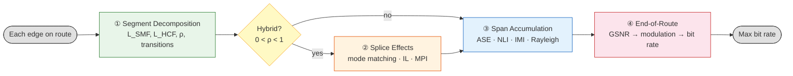

<!-- SEED:PROVENANCE:BEGIN -->
> Seeded verbatim from the vault note `HCF/HCF Phy.md` on 2026-09-16.
> Do not hand-edit the body below — edit the vault note, then run `make seed-sync ARGS=--apply`.
<!-- SEED:PROVENANCE:END -->

### HCF Fiber Physics & Loss Mechanisms
#2 Petrovich, #3 [Sakr](obsidian://open?vault=Obsidian_Vault&file=OCS%2FHFC%2FHCF_phy), #4 Vandenberge, #16 Ali

### Physical-Layer / GSNR Modeling (Noise & Nonlinearity)
#5 Poggiolini, #6 Semrau, #8 Braga (ML-NLI)

### Bidirectional (BiDi) Transmission
#7 EstebanPaz, #13 Hong, #14 Dupas, #15 Mardoyan

### Hybrid Network Design & Fiber Placement
#1 Ibrahimi (primary/system-level), #9 Braga (mixture ratio), #10 Jiang "Beyond Silica" (design assumptions), #12 JoaoPedro (span placement)

### Routing & Spectrum Assignment
#11 Jiang "Transition-Aware Routing", #17 Kim, #18 Lohani

### QoT Estimation & Digital Twin Methods
#19 Renato Ambrosone, #20 Oda

### OCS & Reconfigurable Switching Architectures
#21 Poutievski (Jupiter), #22 Farrington (Helios), #23 Ballani (Sirius)

### Traffic/Workload & OCS Scheduling
#24 Hu (OptiML), #25 Wang (Coflow)

### Calibration & Validation Methodology

## What is HCF; why nested; launching

- Light travels in an **air core**, not in glass. Guidance: **antiresonant reflection** + **inhibited coupling**.
- Why gaps/nested structures: a continuous glass wall would create thick nodes → high leakage and lossy cladding modes; nested tubes add extra antiresonant barriers → much lower leakage; less glass near the core → lower scattering and absorption.
- Launch condition: light must be launched **only into the air core**; input connector/ferrule sized to the air-core diameter, not the full fibre.

# 1. Optical attenuation (loss coefficient α)

Received power after length L: $$P(L)=P_0 e^{-\alpha L}$$ or in dB: $$P_{\mathrm{dB}}(L)=P_0-4.343\alpha L$$

### SMF
- **Rayleigh scattering** (density fluctuations in silica → elastic scattering): $$\alpha_R(\lambda)\propto \frac{1}{\lambda^4}$$ standard SMF: $$\alpha_{\mathrm{SMF}} \approx 0.2\,\mathrm{dB/km}$$
- **Material absorption**: $$\alpha_{\mathrm{abs}}=\alpha_{\mathrm{OH}}+\alpha_{\mathrm{IR}}$$ (OH impurity peaks + IR vibrational absorption)

### Nested HCF
Mode mainly in air: $P_{\mathrm{air}} \approx 99\%$ → minimal silica interaction. Total: $$\alpha_{\mathrm{HCF}} = \alpha_{\mathrm{leak}} + \alpha_{\mathrm{surface}} + \alpha_{\mathrm{scatter}}$$ Modern Nested Antiresonant Nodeless Fibers (NANF): $$\alpha_{\mathrm{HCF}} \approx 0.05\text{--}0.2\,\mathrm{dB/km}$$ approaching or surpassing SMF.

### Three-term attenuation model
$$\alpha_{\rm HCF}(\lambda) = \alpha_{LL}(\lambda) + \alpha_{SSL}(\lambda) + \alpha_{\mu BL}(\lambda) \quad [{\rm dB/km}]$$

- **Leakage / confinement loss** — exact form from a mode solver; semi-analytic scaling used when FEM at every point is not wanted: $$\alpha_{LL}(\lambda) = 8.686\left(\frac{2\pi}{\lambda}\right)\mathrm{Im}[n_{\rm eff}(\lambda)]$$
- $\Theta(\lambda)$, the antiresonance transmission function, is not smooth — loss peaks at the wall-thickness resonances: $$\lambda_m = \frac{2t}{m}\sqrt{n_{\rm wall}^2-1}, \qquad m=1,2,3,\dots$$
- **Surface scattering loss** (frozen capillary-wave theory at the glass–air boundary): $$\alpha_{SSL}(\lambda) = C_{SSL}\cdot F(\lambda)\cdot\left(\frac{\lambda_0}{\lambda}\right)^3, \qquad C_{SSL} = \frac{8\pi^3 k_B T_f}{3\sigma}$$
- **Microbending loss** (coupled-power, Marcuse-type; bend-perturbation spectrum at phase matching): $$\alpha_{\mu BL} \approx K_{\mu B}\cdot\frac{a_{\rm eff}^2}{R_b}\cdot W_p(\Delta\beta), \qquad \Delta\beta = \beta_{01}-\beta_{\rm clad}$$
- Wavelength optimum of the (SSL + μBL) sum: $$\frac{d}{d\lambda}\left(C_1\lambda^{-3}+C_2\lambda^2\right)=0 \Rightarrow \lambda^* = \left(\frac{3C_1}{2C_2}\right)^{1/5}$$

### Radiative fraction vs. modal coupling (SSL and μBL each split)
$$\alpha_{\rm HCF}(\lambda) = \underbrace{\alpha_{LL}(\lambda) + \alpha_{SSL,\rm rad}(\lambda) + \alpha_{\mu BL,\rm rad}}_{\text{true attenuation} \to P(z), G, \text{ASE}} + \underbrace{\alpha_{SSL,\rm HOM}(\lambda) + \alpha_{\mu BL,\rm HOM}}_{\text{modal coupling} \to \kappa \to \text{IMI}}$$

Radiative fraction feeds P(z) → sets amplifier gain → sets ASE; the rest is modal coupling. Used in the power/ASE chain: $$\alpha_{\rm HCF,eff}(\lambda) = \alpha_{LL}(\lambda) + \alpha_{SSL,\rm rad}(\lambda) + \alpha_{\mu BL,\rm rad}$$ $$P_{\rm out} = P_0\cdot 10^{-\alpha_{\rm HCF,eff}L/10}, \qquad G_i \approx 10^{\alpha_{\rm HCF,eff,i} L_i/10}, \qquad P_{\rm ASE,i}=n_{\rm sp}h\nu B_{\rm ref}(G_i-1)$$

Coupling fraction feeds the IMI coefficient instead of the loss budget: $$\kappa_i \approx f\big(\alpha_{SSL,\rm HOM}(\lambda), \alpha_{\mu BL,\rm HOM}, L_i, \Delta\beta_{01\text{-}1n}\big), \qquad P_{\rm IMI,i}=\kappa_i P_0 L_i$$

### Distributed IMI: coupled-mode equations
$$\frac{dP_{01}}{dz} = -\alpha_{01}P_{01} - hP_{01} + hP_{0n}, \qquad \frac{dP_{0n}}{dz} = -\alpha_{0n}P_{0n} - hP_{0n} + hP_{01}$$ $$P_{0n}(z) \approx hP_0\left[\frac{e^{-\alpha_{01}z}-e^{-\alpha_{0n}z}}{\alpha_{0n}-\alpha_{01}}\right]$$ $$P_{\rm IMI}(L) \approx 2\sqrt{P_{01}(L)\,P_{0n}(L)}\,\langle\cos\Delta\phi\rangle \approx \kappa_{\rm eff}(L)\,P_{01}(L)$$

IMI is an extra noise source — additive term in the GSNR calculator, **not** part of α; splice/transition losses are discrete events with an MFD-mismatch formula; HOM coupling terms are FEM-derived differential modal losses.

# 2. Nonlinearity γ

Nonlinear phase shift: $$\phi_{\mathrm{NL}} = \gamma P L_{\mathrm{eff}}$$ with $$\gamma = \frac{2\pi n_2}{\lambda A_{\mathrm{eff}}}, \qquad L_{\mathrm{eff}} = \frac{1-e^{-\alpha L}}{\alpha}$$

### SMF
Silica: $n_2^{\mathrm{SiO_2}} \approx 2.6\times10^{-20}\,\mathrm{m^2/W}$; $A_{\mathrm{eff}} \approx 80\,\mu\mathrm{m}^2$ → $$\gamma_{\mathrm{SMF}} \approx 1\text{--}2\,\mathrm{W}^{-1}\mathrm{km}^{-1}$$ causing SPM, XPM, FWM.

### Nested HCF
Nonlinear medium = air: $n_2^{\mathrm{air}} \approx 3\times10^{-23}\,\mathrm{m^2/W}$ → $$\frac{\gamma_{\mathrm{HCF}}}{\gamma_{\mathrm{SMF}}} \approx \frac{n_2^{\mathrm{air}}}{n_2^{\mathrm{silica}}} \frac{A_{\mathrm{SMF}}}{A_{\mathrm{HCF}}}$$ Even with larger mode area $\gamma_{\mathrm{HCF}} \approx 10^{-3}\,\gamma_{\mathrm{SMF}}$; typical $\gamma_{\mathrm{HCF}} < 0.01\,\mathrm{W}^{-1}\mathrm{km}^{-1}$. Advantages: higher launch power, lower nonlinear penalty, better for coherent transmission.

# 3. Latency advantage

$$T=\frac{n_gL}{c}$$ ($n_g$ = group index.)

- SMF: $n_g^{\mathrm{SMF}} \approx 1.468$ → $v_g=c/1.468$; $T_{\mathrm{SMF}} \approx 4.9\,\mu\mathrm{s/km}$.
- HCF: $n_g^{\mathrm{HCF}} \approx 1.0003$ (energy mostly in air) → $T_{\mathrm{HCF}} \approx 3.34\,\mu\mathrm{s/km}$ (~30% faster).
- Difference: $$\Delta T = \frac{(n_g^{\mathrm{SMF}} - n_g^{\mathrm{HCF}})L}{c}$$ 1000 km → $\Delta T \approx 1.6\,\mathrm{ms}$. For financial networks, distributed AI clusters, HPC interconnects.

# 4. Bidirectional transmission (BiDi)

### SMF limitation
$n_{\mathrm{eff}} = n_{\mathrm{core}}$ + strong nonlinear interaction; same wavelength counter-propagating ($P_{\mathrm{total}} = P_1 + P_2$) → back scattering, nonlinear interaction, isolation requirements.

### HCF advantage
$\gamma_{\mathrm{HCF}} \rightarrow 0$ → minimal interaction between counter-propagating channels: $$P_{\mathrm{BiDi}} \approx P_{\rightarrow} + P_{\leftarrow}$$ without significant nonlinear penalty. Benefits: doubled fiber utilization, easier duplex transmission, reduced fiber count. Rayleigh backscattering (BiDi case): $P_{\rm Rayleigh} \propto$ backscatter coefficient · P(z).

# 5. Mode field diameter (MFD)

MFD = 2w (w = Gaussian mode radius).

- SMF: $\mathrm{MFD}_{\mathrm{SMF}} \approx 10.4\,\mu\mathrm{m}$; $A_{\mathrm{eff}} \approx 80\,\mu\mathrm{m}^2$ → high nonlinear interaction.
- HCF: air core $\mathrm{MFD}_{\mathrm{HCF}} \approx 20\text{--}40\,\mu\mathrm{m}$; $$A_{\mathrm{eff}} = \frac{\left(\int I(r)\,dA\right)^2}{\int I^2(r)\,dA} \quad\Rightarrow\quad A_{\mathrm{eff,HCF}} > A_{\mathrm{eff,SMF}}$$ → lower γ, higher power handling.

# 6. Dispersion

Chromatic dispersion: $$D = -\frac{\lambda}{c} \frac{d^2 n_{\mathrm{eff}}}{d\lambda^2}$$

- SMF: silica-originated, $n_{\mathrm{eff}} = n_{\mathrm{material}} + n_{\mathrm{waveguide}}$; $D_{\mathrm{SMF}} \approx 17\,\mathrm{ps/(nm\cdot km)}$ at 1550 nm.
- HCF: $n_{\mathrm{eff}} \approx 1$ → material dispersion disappears ($D_{\mathrm{material}} \approx 0$); only waveguide term remains: $$D_{\mathrm{HCF}} \approx -\frac{\lambda}{c} \frac{d^2 n_{\mathrm{wg}}}{d\lambda^2}$$ Can reach $|D_{\mathrm{HCF}}| < 1\,\mathrm{ps/(nm\cdot km)}$ → longer coherent reach, simpler DSP, lower equalization complexity.

# 7. Intermodal interference (IMI)

- SMF: single-mode condition $$V = \frac{2\pi a}{\lambda}\,\mathrm{NA} < 2.405$$ ideally LP01 only; bending/imperfections create mode coupling LP01 → LPmn.
- HCF: HE11 fundamental; higher modes LPmn leak more ($\alpha_{mn} > \alpha_{01}$) and naturally disappear. Modal filtering: $$P_m(L)=P_m(0)e^{-\alpha_mL}, \qquad \alpha_m-\alpha_{01}>0$$ → lower modal noise, stable transmission.

# 8. Summary table

|Parameter|SMF|Nested HCF|Advantage|
|---|---|---|---|
|Loss (α)|0.2 dB/km|0.05–0.2 dB/km|similar/lower|
|Nonlinearity (γ)|1–2 W⁻¹km⁻¹|<0.01 W⁻¹km⁻¹|100× reduction|
|Latency|n_g=1.468|n_g≈1.0003|~30% faster|
|MFD|10 μm|20–40 μm|larger mode|
|Dispersion|17 ps/nm/km|≈0|lower DSP|
|Rayleigh scattering|high|very low|less loss|
|IMI|weak|mode filtering|higher stability|
|BiDi|nonlinear limitation|natural compatibility|higher capacity|

Core physical chain — system-level advantages (loss, nonlinearity, latency, BiDi) from fiber-level parameters (α, γ, MFD, D, IMI, Rayleigh scattering):

$$\text{Air core} \rightarrow \begin{cases} n_2\downarrow &\Rightarrow \gamma\downarrow \\ n_g\downarrow &\Rightarrow \text{latency}\downarrow \\ \text{silica overlap}\downarrow &\Rightarrow \alpha\downarrow \\ \frac{d^2n}{d\lambda^2}\downarrow &\Rightarrow D\downarrow \end{cases}$$

# Hybrid SMF + HCF mathematical model (GSNR)

Lightpath: N spans, each of type SMF or HCF.

Power evolution (incl. transition loss): $$P_i = P_{i-1}\cdot 10^{-\alpha_{t_i}L_i/10}\cdot 10^{-\alpha_{\text{tr},i}/10}$$

Generalised SNR at the receiver — equivalent inverse form:
$$\text{GSNR}^{-1} = \text{SNR}_{\text{ASE}}^{-1} + \text{SNR}_{\text{NLI}}^{-1} + \text{SNR}_{\text{IMI}}^{-1} + \text{SNR}_{\text{other}}^{-1}, \qquad \text{GSNR} = \frac{P_{\text{Rx}}}{P_{\text{ASE}} + P_{\text{NLI}} + P_{\text{IMI}} + P_{\text{other}}}$$

(a) **ASE** (all spans): $$P_{\text{ASE}} = \sum_{i=1}^{N} n_{\text{sp},i}\, h\nu\, B_{\text{ref}} \,(G_i-1)$$
(b) **Kerr NLI** — only from SMF sections: $$P_{\text{NLI}} = \sum_{\substack{i=1 \\ t_i=\text{SMF}}}^{N} \eta_i\, P_i^3$$
(c) **IMI** — only from HCF sections: $$P_{\text{IMI}} = \sum_{\substack{i=1 \\ t_i=\text{HCF}}}^{N} \kappa_i\, P_i\, L_i$$
(d) **Other optional**: MPI / Rayleigh (very small in HCF, larger in SMF); transceiver noise floor; filtering penalties from ROADMs / OCS.

Regime: short SMF links → ASE dominates; long SMF links → NLI comparable or dominant; HCF links → ASE + IMI dominate (NLI ≈ 0).

Correctly sourced: $${\rm GSNR}=\frac{P_{\rm Rx}}{\sum_i P_{{\rm ASE},i}+\sum_{i\in{\rm SMF}}P_{{\rm NLI},i}+\sum_{i\in{\rm HCF}}P_{{\rm IMI},i}}$$

### ASE & OSNR (per span and accumulated)
Span loss $A_i = 10^{\alpha_i L_i / 10}$ (span_loss_dB = α_i·L_i); amplifier gain exactly compensates: $G_i = A_i = 10^{\alpha_i L_i / 10}$.

ASE from one amplifier (reference bandwidth Δf), n_sp or NF form: $$P_{\rm ASE,i} = 2 \cdot n_{\rm sp,i} \cdot h \cdot \nu \cdot (G_i - 1) \cdot \Delta f = {\rm NF}_i \cdot h \cdot \nu \cdot (G_i - 1) \cdot \Delta f$$

- h = 6.626 × 10⁻³⁴ J·s; ν = c/λ ≈ 193.4 THz (at 1550 nm); Δf = 12.5 GHz (standard OSNR reference bandwidth); NF_i = linear noise figure of the amplifier after span i.

Accumulation over N spans: $$P_{\rm ASE,total} = \sum_{i=1}^{N} P_{\rm ASE,i} \cdot \underbrace{\left( \prod_{k=i+1}^{N} \frac{G_k}{A_k} \right)}_{\text{usually }=1}$$ When every amplifier compensates its span ($G_k = A_k$): $$P_{\rm ASE,total} = \sum_{i=1}^{N} P_{\rm ASE,i} = h\nu\Delta f \sum_{i=1}^{N} {\rm NF}_i (G_i - 1)$$ ASE-only OSNR: $${\rm OSNR} = \frac{P_{\rm signal}}{P_{\rm ASE,total}}$$

Hybrid SMF + HCF (spans indexed by type): $$P_{\rm ASE,total} = h\nu\Delta f \Biggl\{ \sum_{i\in{\rm SMF}} {\rm NF}_i^{\rm SMF}(G_i^{\rm SMF}-1) + \sum_{i\in{\rm HCF}} {\rm NF}_i^{\rm HCF}(G_i^{\rm HCF}-1) \Biggr\}$$

Typical values in practice:

| Parameter       | SMF          | HCF              |
|-----------------|--------------|------------------|
| α               | 0.16–0.20 dB/km | 0.05–0.12 dB/km |
| NF (dB)         | 4.0–5.5      | 5.0–7.0 (often higher) |
| Span length     | 80–100 km    | 80–100 km (or longer) |

Generalized SNR (complete metric for coherent systems): $$\frac{1}{\rm GSNR} = \frac{1}{\rm OSNR_{\rm ASE}} + \frac{1}{\rm SNR_{\rm NLI}} + \frac{1}{\rm SNR_{\rm IMI}} + \frac{1}{\rm SNR_{\rm MPI}} + \cdots$$

Compact expressions (code/slides): $$P_i = P_{i-1}\cdot 10^{-\alpha_i L_i/10}, \qquad P_{\rm ASE,i} = {\rm NF}_i\cdot h\cdot\nu\cdot(10^{\alpha_i L_i/10}-1)\cdot\Delta f, \qquad P_{\rm ASE,total} = \sum_{i=1}^{N} P_{\rm ASE,i}$$ $${\rm OSNR} = \frac{P_{\rm Rx}}{P_{\rm ASE,total}}, \qquad {\rm GSNR} = \Biggl( \frac{1}{\rm OSNR} + \frac{P_{\rm NLI}}{P_{\rm Rx}} + \frac{P_{\rm IMI}}{P_{\rm Rx}} + \frac{P_{\rm MPI}}{P_{\rm Rx}} \Biggr)^{-1}$$

Complete noise picture of a hybrid link:

| Noise term | Generated where          | Dominant in             |
| ---------- | ------------------------ | ----------------------- |
| ASE        | Amplifiers               | All links               |
| NLI        | SMF sections only        | Long SMF / hybrid links |
| IMI        | Distributed along HCF    | Pure or long HCF        |
| MPI        | Discrete splices SMF↔HCF | Hybrid links            |

### NLI physics inside the GN model (SPM / XPM / FWM)
Occur while light travels inside the fibre; all from the same nonlinearity γ:

| Effect | Physical meaning | Where it appears in the GN model |
|--------|------------------|----------------------------------|
| **SPM** (Self-Phase Modulation) | A channel modulates its **own** phase through the Kerr effect | SCI (Self-Channel Interference) |
| **XPM** (Cross-Phase Modulation) | One channel modulates the phase of **another** channel | XCI (Cross-Channel Interference) |
| **FWM** (Four-Wave Mixing) | Three waves create a fourth wave at a new frequency | Also collected inside the XCI term |

GN model sums them into a single noise power: $$P_{\rm NLI} = \eta \, P_{\rm ch}^3$$ per-span nonlinear coefficient: $$\eta \propto \gamma^2 L_{\rm eff}^2 \cdot \frac{\text{arcsinh}\!\bigl(\pi^2 |\beta_2| L_{\rm eff} R_s^2 N_{\rm ch}\bigr)}{\pi |\beta_2| L_{\rm eff} R_s^2}$$

Hybrid-key point: inside **SMF** γ ≈ 1.3 W⁻¹km⁻¹ → NLI significant; inside **HCF** γ ≈ 10⁻³–10⁻⁴ W⁻¹km⁻¹ → P_NLI ≈ 0. NLI accumulates **only on SMF sections**.

# Splice / transition losses, MPI & IMI at SMF↔HCF interfaces

Different physics from an SMF–SMF splice: not Gaussian→Gaussian mode matching, plus a hard index step (glass core → air core). Total splice transmission:

$$\eta_{\rm splice} = \underbrace{\eta_{MFD}}_{\text{mode-size mismatch}} \cdot \underbrace{\eta_{\rm lat}}_{\text{offset}} \cdot \underbrace{(1-R_{\rm eff}(\theta))}_{\text{Fresnel/index step}} \cdot \underbrace{(1-\kappa_{\rm splice})}_{\text{power diverted to HOMs}}, \qquad IL_{\rm splice}\,({\rm dB}) = -10\log_{10}\eta_{\rm splice}$$

The last factor is pulled out of the "loss" product deliberately — power coupled into a higher-order mode isn't gone, it reappears later as interference (same logic as the SSL/μBL split).

- **Mode-size mismatch** (weak-coupling Gaussian overlap, Petermann-II spot sizes w1, w2): $$\eta_{MFD} = \left(\frac{2w_1w_2}{w_1^2+w_2^2}\right)^2$$ HCF fundamental fields aren't quite Gaussian (large flattened core; ~23–24 µm MFD typical for NANF) → for real designs use the general overlap integral: $$\eta_{MFD} = \frac{\left|\int\int E_1^*E_2\,dA\right|^2}{\int\int|E_1|^2dA\int\int|E_2|^2dA}$$
- **Lateral offset**: $$\eta_{\rm lat} = \exp\left(-\frac{2\delta^2}{w_1^2+w_2^2}\right)$$

### Fresnel / index-step reflection (absent from SMF–SMF formulas)
Even a perfectly matched, aligned splice reflects power — the modal effective index jumps from silica to near-vacuum: $$R_0 = \left(\frac{n_{\rm eff,SMF}-n_{\rm eff,HCF}}{n_{\rm eff,SMF}+n_{\rm eff,HCF}}\right)^2$$ With $n_{\rm eff,SMF}\approx1.4468$, $n_{\rm eff,HCF}\approx1$: $R_0\approx0.033$ → ≈ −14.8 dB, matching measured flat-cleaved SMF–NANF splices (~0.7 dB IL, ~−15 dB back-reflection).

**Angle-cleaving** does not remove R0 (~3.3% still reflects); it walks the reflected cone outside the fibre NA so it doesn't recouple as guided back-reflection: $$R_{\rm coupled}(\theta) \approx R_0\cdot\exp\left[-\left(\frac{4\pi n w \theta}{\lambda}\right)^2\right]$$ Trade, not free lunch: a 2.2° angle cleave suppresses back-reflection by 25 dB (to < −40 dB) at the cost of +0.6 dB IL (≈1.3 dB total) — the tilt also walks off part of the forward-coupled field. Measured angle-cleaved connection loss came out only 0.2–0.3 dB above the MFD-mismatch-plus-angle-cleave model → multiplicative model is a reasonable first-pass fit.

### HOM leakage at the splice — a discrete IMI source
Cross-coupling into the first HOM measured as low as −35 dB (into LP11). Unlike distributed SSL/μBL coupling h(z), this is a delta-function boundary condition $P_{0n}(0^+) = \kappa_{\rm splice}P_0$, then decays under HCF differential modal loss: $$P_{0n}(z) = \kappa_{\rm splice}\,P_0\,e^{-\alpha_{0n}z}, \qquad P_{\rm IMI,splice}(z) \approx 2\sqrt{P_{01}(z)P_{0n}(z)}\,\langle\cos\Delta\phi\rangle$$ HOMs in NANF-type HCF are strongly filtered ($\alpha_{0n}\gg\alpha_{01}$) → decays fast; splice-induced IMI matters most for **short** HCF jumpers or closely spaced splices, negligible by the far end of a long span (unlike distributed SSL/μBL, roughly constant per unit length).

### Counting splices into the link budget / GSNR
Splice loss is **lumped**, not distributed — a step in P(z), not part of the exponential decay: $${\rm Loss}_{\rm HCF,cell}\,({\rm dB}) = IL_{\rm splice,in} + \alpha_{\rm HCF,eff}L_{\rm HCF} + IL_{\rm splice,out}$$ $$G_i \approx 10^{\left(IL_{\rm splice,in}+\alpha_{\rm HCF,eff,i}L_{\rm HCF,i}+IL_{\rm splice,out}\right)/10}, \qquad P_{\rm ASE,i}=n_{\rm sp}h\nu B_{\rm ref}(G_i-1)$$ Each HCF span needs two splices (SMF→HCF, HCF→SMF); for N_HCF hybrid spans: $$IL_{\rm splice,total} \approx 2N_{\rm HCF}\cdot\overline{IL_{\rm splice}}$$ Updated IMI sum (distributed + discrete per span): $$P_{{\rm IMI},i} = \underbrace{\kappa_i P_0 L_i}_{\text{distributed}} + \underbrace{\kappa_{\rm splice,i}\,P_0\,e^{-\alpha_{0n}z_i}}_{\text{discrete}}$$ $${\rm GSNR}=\frac{P_{\rm Rx}}{\sum_i P_{{\rm ASE},i}(G_i \text{ incl. splice loss})+\sum_{i\in{\rm SMF}}P_{{\rm NLI},i}+\sum_{i\in{\rm HCF}}P_{{\rm IMI},i}}$$

### Mode decomposition & MPI at the receiver
Fundamental-mode coupling = overlap integral: $$\eta_{00} = \left| \iint E_{\rm SMF}^{\rm LP01}(x,y)\, E_{\rm HCF}^{\rm LP01*}(x,y)\,dx\,dy \right|^2$$ Very different MFDs (SMF ≈ 10.4 µm, HCF ≈ 22–28 µm) → imperfect overlap: $$\eta_{00} \approx 0.2\ \text{–}\ 0.4 \quad \Rightarrow \quad 4\ \text{–}\ 7\,{\rm dB}\ \text{raw coupling loss}$$ (reducible to 0.3–1.0 dB with a properly designed mode-field adapter). Field entering the HCF decomposes into HCF modes: $$E_{\rm in} = \sqrt{\eta_{00}}\,E_{\rm LP01} + \sqrt{\eta_{11}}\,E_{\rm LP11} + \sqrt{\eta_{21}}\,E_{\rm LP21} + \cdots + \text{radiation}$$ (η_lm = power launched into each HOM.) Residual HOMs beat with the fundamental on the photodetector: $$E_{\rm total} = E_{\rm LP01} + \sum_i E_{\rm HOM,i}\,e^{j\Delta\varphi_i}$$ $$I \propto |E_{\rm LP01}|^2 + \sum_i |E_{\rm HOM,i}|^2 + 2\sum_i |E_{\rm LP01}|\,|E_{\rm HOM,i}|\,\cos(\Delta\varphi_i)$$ The last term is the **MPI noise**: $${\rm MPI_{\rm dB}} = 10\log_{10}\left( \frac{\sum_i P_{\rm HOM,i}}{P_{\rm LP01}} \right)$$ Typical: high-quality mode-field adapter → MPI < −40 to −50 dB; poor splice → −25 to −35 dB (system-limiting).

### Benchmark table

| Configuration             | Insertion loss | Back-reflection | HOM coupling  |
| ------------------------- | -------------- | --------------- | ------------- |
| Flat-cleaved SMF–NANF     | ~0.7 dB        | ~−15 dB         | —             |
| 2.2° angle-cleaved        | ~1.3 dB        | < −40 dB        | −35 dB (LP11) |
| GI-MMF mode-field adapter | 0.15 dB        | —               | measured, low |
| TEC mode-field adapter    | 0.21 dB        | —               | measured      |
| PBG-HCF w/ AR coating     | 0.3 dB         | < −30 dB        | —             |

# Hybrid SMF–HCF Route Impairment Model

Input: route (sequence of edges), traffic demand, available TXPs → output: maximum feasible bit rate + chosen modulation format. Per edge on the route:

1. **Segment decomposition** — determine SMF length (L_SMF) and HCF length (L_HCF); hybrid ratio ρ = L_HCF / (L_SMF + L_HCF); number and location of SMF↔HCF transitions.
2. **Interface / splice effects** (only if hybrid, 0 < ρ < 1):
   - Mode-field matching per transition: overlap-integral calculation (analytical), beam-propagation method (BPM), or measured MFA (Mode-Field Adapter) loss.
   - Splice / transition insertion loss: α_splice = f(MFD_SMF, MFD_HCF, alignment, angle).
   - Mode decomposition: project input field onto HCF modes (LP01, LP11, …) → power coupling coefficients η_01, η_11, …
   - Residual HOM power → MPI: MPI ≈ 10·log10(residual HOM power after filtering); add connector / Fresnel-reflection MPI (if any).
3. **Fibre-span impairment accumulation** (per fibre type; each segment divided into amplifier spans; per span):
   - Power evolution: P(z) = P0 · 10^(−α·z/10).
   - ASE (EDFA or Raman): P_ASE ∝ n_sp · hν · B_ref · (G−1).
   - NLI: SMF → full GN / EGN / ISRS-aware model; HCF → γ ≈ 0 → P_NLI ≈ 0.
   - IMI (HCF only): P_IMI = κ · P_ch · L_span.
   - Rayleigh backscattering (BiDi case): P_Rayleigh ∝ backscatter coefficient · P(z).
   - Every splice / transition = lumped-loss element → extra ASE penalty in the following amplifier.
4. **End-of-route combination**: collect P_ASE,total, P_NLI,total, P_IMI,total, P_MPI,total, P_Rayleigh,total; 1/GSNR = 1/OSNR_ASE + 1/SNR_NLI + 1/SNR_IMI + 1/SNR_MPI + …; compare GSNR vs TXP thresholds (QPSK → 8QAM → 16QAM → 32QAM → 64QAM …); pick highest feasible modulation format → compute maximum bit rate (bit/s).

